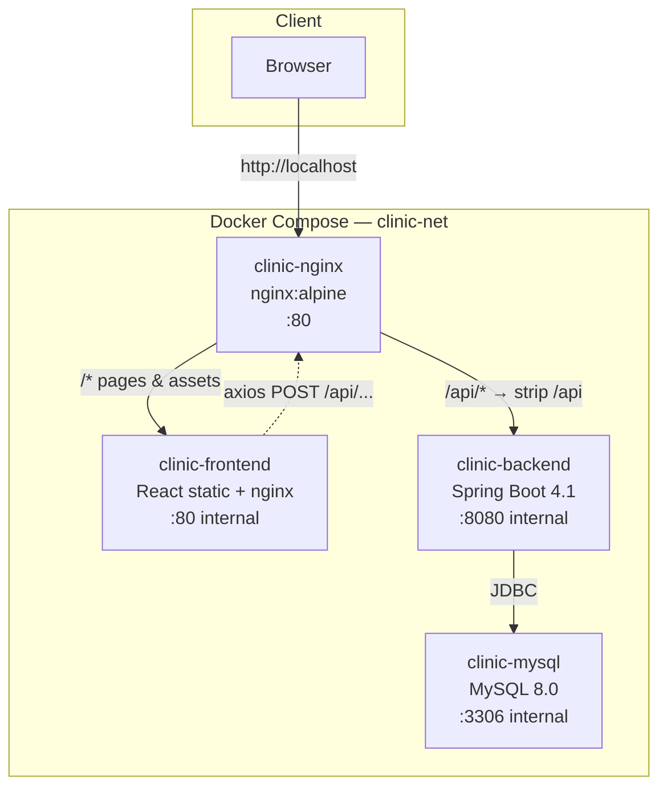
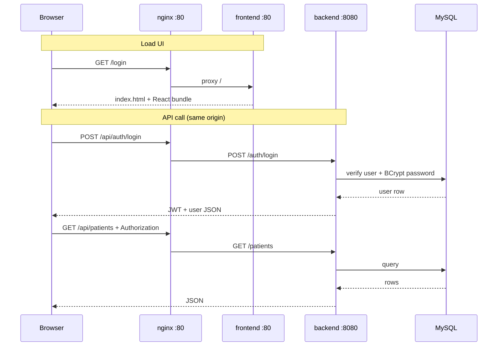

# Clinic Management System

A full-stack clinic management application for patients, doctors, appointments, consultations, and prescriptions — with role-based access control, JWT authentication, and a Docker-based production stack.

## Tech stack

| Layer | Technologies |
|-------|----------------|
| **Backend** | Java 21, Spring Boot 4.1, Spring Security, JWT, Spring Data JPA, MySQL |
| **Frontend** | React 19, TypeScript, Vite, TanStack Query, React Router, Tailwind CSS |
| **Infrastructure** | Docker, Docker Compose, nginx, MySQL 8, GitHub Actions |

## Architecture

### Deployment diagram



### Request flow



### Startup & healthchecks

```text
MySQL starts
   ↓  mysqladmin ping (healthcheck)
MySQL healthy
   ↓  depends_on: service_healthy
Backend starts (prod profile)
   ↓  curl /actuator/health (healthcheck)
Backend healthy
   ↓  depends_on: service_healthy
nginx starts (frontend already running)
   ↓
Stack ready on http://localhost
```

| Service | Healthcheck | Host port |
|---------|-------------|-----------|
| `mysql` | `mysqladmin ping` | none |
| `backend` | `curl /actuator/health` | none |
| `frontend` | — | none |
| `nginx` | — | **80** |

On first production startup, Hibernate creates the schema and `SqlDatabaseSeeder` seeds demo users when the database is empty.

### Dev vs production routing

| Environment | Page URL | API base URL | API routing |
|-------------|----------|--------------|-------------|
| **Docker** | `http://localhost` | `/api` (baked into build) | nginx → backend |
| **Vite dev** | `http://localhost:5173` | `/api` | Vite proxy → `:8080` |
| **Maven only** | — | `http://localhost:8080` | direct to backend |

---

## Data model

### ER diagram

```mermaid
erDiagram
    USERS {
        bigint id PK
        varchar name
        varchar email UK
        varchar phone
        varchar password
        enum role "ADMIN|DOCTOR|PATIENT|RECEPTIONIST"
    }

    PATIENT {
        bigint id PK
        bigint user_id FK UK
        varchar gender
        varchar address
        varchar emergency_contact
        varchar blood_group
        date dob
        varchar medical_history
    }

    DOCTOR {
        bigint id PK
        bigint user_id FK UK
        varchar specialization
        int experience
        double consultation_fee
        time start_time
        time end_time
    }

    APPOINTMENT {
        bigint id PK
        bigint patient_id FK
        bigint doctor_id FK
        datetime appointment_time
        enum status "BOOKED|CANCELLED|COMPLETED"
    }

    CONSULTATION {
        bigint id PK
        bigint appointment_id FK UK
        varchar symptoms
        varchar diagnosis
        varchar notes
    }

    PRESCRIPTION {
        bigint id PK
        bigint consultation_id FK
        varchar medicine
        varchar dosage
        varchar frequency
        varchar duration
        varchar instructions
    }

    USERS ||--o| PATIENT : "role=PATIENT"
    USERS ||--o| DOCTOR : "role=DOCTOR"
    PATIENT ||--o{ APPOINTMENT : books
    DOCTOR ||--o{ APPOINTMENT : attends
    APPOINTMENT ||--o| CONSULTATION : "recorded as"
    CONSULTATION ||--o| PRESCRIPTION : "may have"
```

### Entity reference

#### `User` → table `users`

Central auth account. Implements Spring Security `UserDetails`. Email is the login username.

| Field | Type | Notes |
|-------|------|-------|
| `id` | `Long` | PK, auto-increment |
| `name` | `String` | Display name |
| `email` | `String` | Unique, used for login |
| `phone` | `String` | |
| `password` | `String` | BCrypt hash |
| `role` | `Role` | See enum below |

**Relationships:** optional one-to-one with `Patient` or `Doctor` depending on role. Admin and receptionist have no profile entity.

#### `Role` (enum)

`ADMIN` · `DOCTOR` · `PATIENT` · `RECEPTIONIST`

#### `Patient` → table `patient`

Clinical profile for users with role `PATIENT`.

| Field | Type | Notes |
|-------|------|-------|
| `id` | `Long` | PK |
| `user_id` | `Long` | FK → `users`, unique, required |
| `gender` | `String` | |
| `address` | `String` | max 100 |
| `emergencyContact` | `String` | max 15 |
| `bloodGroup` | `String` | max 3 |
| `dob` | `LocalDate` | |
| `medicalHistory` | `String` | max 500 |

**Relationships:** `User` (1:1) · `Appointment` (1:N)

#### `Doctor` → table `doctor`

Profile for users with role `DOCTOR`.

| Field | Type | Notes |
|-------|------|-------|
| `id` | `Long` | PK |
| `user_id` | `Long` | FK → `users`, unique, required |
| `specialization` | `String` | max 60 |
| `experience` | `Integer` | Years |
| `consultationFee` | `Double` | |
| `startTime` | `LocalTime` | Working hours start |
| `endTime` | `LocalTime` | Working hours end |

**Relationships:** `User` (1:1) · `Appointment` (1:N)

#### `Appointment` → table `appointment`

Links a patient to a doctor at a scheduled time.

| Field | Type | Notes |
|-------|------|-------|
| `id` | `Long` | PK |
| `patient_id` | `Long` | FK → `patient` |
| `doctor_id` | `Long` | FK → `doctor` |
| `appointmentTime` | `LocalDateTime` | |
| `status` | `AppointmentStatus` | `BOOKED` · `CANCELLED` · `COMPLETED` |

**Relationships:** `Patient` (N:1) · `Doctor` (N:1) · `Consultation` (1:0..1)

Recording a consultation for a `BOOKED` appointment sets status to `COMPLETED`.

#### `Consultation` → table `consultation`

Clinical notes for a completed visit. One consultation per appointment.

| Field | Type | Notes |
|-------|------|-------|
| `id` | `Long` | PK |
| `appointment_id` | `Long` | FK → `appointment`, unique |
| `symptoms` | `String` | max 60 |
| `diagnosis` | `String` | max 100 |
| `notes` | `String` | max 100 |

**Relationships:** `Appointment` (1:1) · `Prescription` (1:0..1)

#### `Prescription` → table `prescription`

Medication details tied to a consultation.

| Field | Type | Notes |
|-------|------|-------|
| `id` | `Long` | PK |
| `consultation_id` | `Long` | FK → `consultation` |
| `medicine` | `String` | max 100 |
| `dosage` | `String` | max 100 |
| `frequency` | `String` | max 100 |
| `duration` | `String` | |
| `instructions` | `String` | max 100 |

**Relationships:** `Consultation` (1:1 in JPA mapping)

### Domain flow

```text
User (PATIENT) ──► Patient ──► Appointment ◄── Doctor ◄── User (DOCTOR)
                                    │
                                    ▼
                              Consultation
                                    │
                                    ▼
                              Prescription
```

---

## Features

- **Authentication** — JWT login; BCrypt password hashing
- **RBAC** — `ADMIN`, `DOCTOR`, `RECEPTIONIST`, `PATIENT`
- **Patients** — CRUD, search, summary, linked appointments & prescriptions
- **Doctors** — CRUD, specializations, schedules
- **Appointments** — booking, status workflow (`BOOKED` → `COMPLETED`)
- **Consultations** — record visits; auto-completes linked appointments
- **Prescriptions** — linked to consultations and patients
- **Health checks** — Spring Actuator + Docker healthchecks for MySQL and backend

## Prerequisites

- **Local dev:** Java 21, Maven, Node.js 22+, MySQL 8
- **Docker:** Docker Engine + Docker Compose
- **CI/CD:** Docker Hub account; VPS with Docker (optional, for deploy job)

## Quick start (Docker)

1. **Clone and configure environment**

   ```bash
   git clone https://github.com/Raaghav-m/Clinic-Management.git
   cd Clinic-Management
   cp .env.example .env
   ```

   Edit `.env` and set at minimum:

   | Variable | Description |
   |----------|-------------|
   | `DOCKERHUB_USERNAME` | Docker Hub namespace for images |
   | `DB_NAME` | Database name (e.g. `clinic_db`) |
   | `DB_USERNAME` | App DB user (not `root`) |
   | `DB_PASSWORD` | App DB password |
   | `MYSQL_ROOT_PASSWORD` | MySQL root password |
   | `JWT_SECRET` | Base64-encoded secret for JWT signing |

   Generate a JWT secret:

   ```bash
   openssl rand -base64 64
   ```

2. **Pull images and start the stack**

   ```bash
   docker compose up -d
   ```

3. **Open the app**

   ```text
   http://localhost
   ```

4. **Check service health**

   ```bash
   docker compose ps
   docker exec clinic-backend curl -fsS http://localhost:8080/actuator/health
   ```

### Demo login (after seed)

All seeded users share the password **`Password@123`**.

| Role | Email |
|------|-------|
| Admin | `admin@clinic.com` |
| Doctor | `ananya.reddy@clinic.com` |
| Receptionist | `receptionist1@clinic.com` |
| Patient | `priya.sharma@gmail.com` |

## Local development

### Backend

1. Copy `.env.example` → `.env` and configure MySQL credentials for local use.
2. Ensure MySQL is running with database `clinic_db`.
3. Start with the **dev** profile:

   ```bash
   set -a && source .env && set +a
   SPRING_PROFILES_ACTIVE=dev ./mvnw spring-boot:run
   ```

   Dev profile uses `ddl-auto: update` against `localhost:3306`.

4. Run tests:

   ```bash
   ./mvnw clean test
   ```

   API: `http://localhost:8080`  
   Swagger UI: `http://localhost:8080/swagger-ui.html`

### Frontend

```bash
cd frontend
cp .env.example .env   # VITE_API_BASE_URL=/api
npm ci
npm run dev
```

App: `http://localhost:5173` — Vite proxies `/api` → `http://localhost:8080`.

## Configuration

Spring profiles:

| Profile | Use case | Datasource | DDL |
|---------|----------|------------|-----|
| `dev` | Local Maven | `localhost:3306` | `update` |
| `prod` | Docker backend | `mysql:3306` via env vars | `validate` (overridden to `update` in Compose until migrations exist) |

Key files:

```text
src/main/resources/
├── application.yml       # shared (port, JWT expiry, actuator)
├── application-dev.yml   # local development
└── application-prod.yml  # Docker / production
```

Actuator exposes only `/actuator/health` (unauthenticated). All other API routes require a JWT.

## API overview

| Prefix | Description |
|--------|-------------|
| `/auth` | Login |
| `/patients` | Patient management |
| `/doctors` | Doctor management |
| `/appointments` | Appointments |
| `/consultation` | Consultations |
| `/prescriptions` | Prescriptions |

Through nginx in production, all API calls use the `/api` prefix (e.g. `/api/patients`).

## Building Docker images locally

**Backend** (from repo root):

```bash
docker build -t $DOCKERHUB_USERNAME/clinic-backend:latest .
```

**Frontend** (bakes in `VITE_API_BASE_URL=/api`):

```bash
docker build -t $DOCKERHUB_USERNAME/clinic-frontend:latest ./frontend
```

Then restart:

```bash
docker compose up -d --force-recreate
```

## CI/CD

GitHub Actions workflow (`.github/workflows/ci.yml`) on push to `main`:

1. Build & test backend with Maven
2. Build and push `clinic-backend` and `clinic-frontend` to Docker Hub
3. Deploy to VPS via SSH — `docker compose pull && docker compose up -d`

Required GitHub secrets:

| Secret | Purpose |
|--------|---------|
| `DOCKERHUB_USERNAME` | Docker Hub namespace |
| `DOCKERHUB_TOKEN` | Docker Hub access token |
| `VPS_HOST` | Server hostname / IP |
| `VPS_USERNAME` | SSH user |
| `VPS_SSH_KEY` | Private SSH key |

The VPS needs `~/clinic` with `compose.yml`, `nginx/nginx.conf`, and a `.env` file.

## Project structure

```text
clinic/
├── src/                    # Spring Boot backend
├── frontend/               # React SPA
├── nginx/nginx.conf        # Reverse proxy (/api → backend, / → frontend)
├── compose.yml             # Production stack
├── dockerfile              # Backend image
├── frontend/dockerfile     # Frontend image (nginx + static build)
├── .env.example            # Environment template
└── .github/workflows/      # CI/CD
```

## Troubleshooting

| Issue | Fix |
|-------|-----|
| Compose shows empty env vars | Ensure `.env` exists; run `unset DB_PASSWORD DB_NAME DOCKERHUB_USERNAME` if shell overrides |
| Backend unhealthy on fresh DB | First boot needs schema — Compose sets `SPRING_JPA_HIBERNATE_DDL_AUTO=update` |
| MySQL auth denied after credential change | Reset volume: `docker compose down -v && docker compose up -d` |
| Login fails in browser but API works | Rebuild frontend with `/api` base URL; hard-refresh (`Cmd+Shift+R`) |
| Container name conflict | `docker rm -f clinic-frontend clinic-backend clinic-mysql clinic-nginx` |

## Roadmap

- [ ] Flyway/Liquibase schema migrations (replace `ddl-auto: update` in prod)
- [ ] HTTPS / TLS termination
- [ ] Structured logging and monitoring

## License

Private / educational project — add a license if you plan to open-source.
